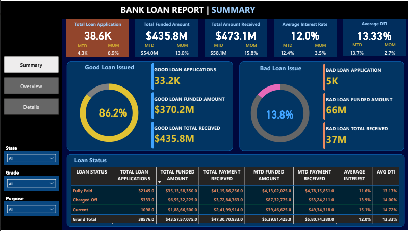
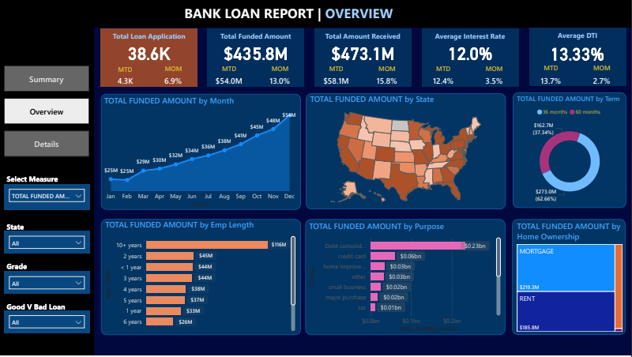
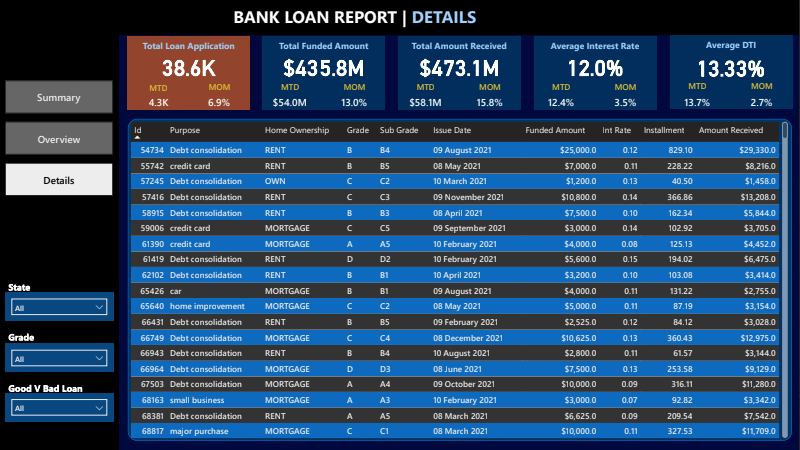

# 🏦 Bank Loan Analysis Dashboard | Power BI Project

<div align="center">


**An interactive Power BI dashboard for comprehensive bank loan portfolio analysis and risk assessment**

[Features](#-key-features) • [Dashboard Views](#-dashboard-overview) • [Documentation](#-documentation) • [Contact](#-contact)

### 🌐 [**View Live Interactive Report**](https://app.powerbi.com/links/UsKG7U0I75?ctid=8c346067-4cb5-4c39-be58-9114ac022469&pbi_source=linkShare&bookmarkGuid=92ee7846-09e2-49cb-8c98-17e257ade857)

💡 **Feel free to explore the `.pbix` file and adapt it to your own customer datasets!**

</div>

---

## 📊 Project Overview

This Power BI project provides a comprehensive analysis of bank loan data, enabling financial institutions to make data-driven decisions through interactive visualizations and KPI tracking. The dashboard analyzes **38.6K loan applications** worth **$435.8M in funded amount** with detailed insights into loan performance, risk assessment, and portfolio management.

### 🎯 Business Objectives

- **Risk Assessment**: Evaluate creditworthiness and predict default probabilities
- **Portfolio Management**: Monitor loan health and optimize lending terms
- **Decision Support**: Data-driven insights for loan approval processes
- **Regulatory Compliance**: Track and report loan data for regulatory requirements
- **Profitability Analysis**: Assess interest income and portfolio performance
- **Customer Insights**: Understand borrower behavior and preferences

---

## ✨ Key Features

### 📈 Advanced Analytics
- **Real-time KPI Monitoring** - Track Total Loan Applications, Funded Amount, Amount Received, Average Interest Rate, and Average DTI
- **MTD vs MoM Comparison** - Month-to-Date and Month-over-Month performance analysis
- **Loan Classification** - Segregation of Good Loans (86.2%) vs Bad Loans (13.8%)
- **Multi-dimensional Analysis** - Analyze by State, Purpose, Term, Grade, and Employment Length

### 🎨 Interactive Visualizations
- Trend analysis with time-series charts
- Geographic distribution maps
- Loan status breakdown with donut charts
- Purpose-wise and term-wise segmentation
- Grade-based risk classification
- Employee length correlation analysis

### 🔍 Comprehensive Filtering
- State-wise filtering
- Grade and Sub-grade selection
- Purpose-based segmentation
- Loan status filtering
- Dynamic slicers for custom analysis

---

## 🖥️ Dashboard Overview

### 1️⃣ Summary Page
The Summary page provides a high-level overview of the entire loan portfolio with key performance indicators:



**Key Metrics Displayed:**
- 📊 Total Loan Applications: **38.6K** (MTD: 4.3K | MoM: 6.9%)
- 💰 Total Funded Amount: **$435.8M** (MTD: $54.0M | MoM: 13.0%)
- 💵 Total Amount Received: **$473.1M** (MTD: $58.1M | MoM: 15.8%)
- 📈 Average Interest Rate: **12.0%** (MTD: 12.4% | MoM: 3.5%)
- 📉 Average DTI: **13.33%** (MTD: 13.7% | MoM: 2.7%)

**Good Loan vs Bad Loan Analysis:**
- ✅ Good Loans: 86.2% of applications | $370.2M funded | $408.9M received
- ❌ Bad Loans: 13.8% of applications | $66M funded | $37M received

**Loan Status Breakdown:**
- Fully Paid, Charged Off, and Current loan performance metrics
- Detailed payment tracking and recovery analysis

---

### 2️⃣ Overview Page
The Overview page delivers detailed trend analysis and distribution patterns:



**Visualizations Include:**
- 📅 **Monthly Trend Analysis**: Total funded amount growth from January to December
- 🗺️ **Geographic Distribution**: State-wise loan distribution across USA
- 👔 **Employment Length Analysis**: Loan distribution by borrower employment stability
- 🎯 **Purpose Analysis**: Breakdown by Debt Consolidation, Credit Card, Home Improvement, etc.
- 🏠 **Home Ownership**: Distribution across Mortgage, Rent, and Own categories
- ⏱️ **Term Analysis**: 36-month vs 60-month loan distribution

**Dynamic Filters:**
- State selection dropdown
- Grade filtering (A through G)
- Purpose-based filtering
- Loan status selector

---

### 3️⃣ Details Page
The Details page provides granular loan-level information with a comprehensive data table:



**Detailed Loan Information:**
- 🆔 Loan ID tracking
- 🎯 Purpose categorization
- 🏠 Home ownership status
- 🎓 Grade and Sub-grade classification
- 📅 Issue date tracking
- 💰 Funded amount
- 📊 Interest rate
- 💵 Installment amount
- 💳 Amount received

**Advanced Filtering:**
- Multi-select filters for State, Grade, and Purpose
- Good vs Bad loan segregation
- Sortable columns for custom analysis
- Search and filter capabilities

---

## 🛠️ Technical Architecture

### Data Model
```
├── Loan Applications (Fact Table)
│   ├── Loan ID (Primary Key)
│   ├── Customer Information
│   ├── Loan Details
│   ├── Financial Metrics
│   └── Status Information
│
├── Date Dimension
│   ├── Date Key
│   ├── Month
│   ├── Year
│   └── Quarter
│
└── Lookup Tables
    ├── State
    ├── Grade
    ├── Purpose
    └── Loan Status
```

### Key Measures & DAX Calculations
```dax
Total Loan Applications = COUNT(loan_data[id])

Total Funded Amount = SUM(loan_data[loan_amount])

Total Amount Received = SUM(loan_data[total_payment])

Average Interest Rate = AVERAGE(loan_data[int_rate])

Average DTI = AVERAGE(loan_data[dti])

MTD Measures = TOTALMTD([Measure], DateTable[Date])

MoM Growth % = DIVIDE([Current Month] - [Previous Month], [Previous Month])

Good Loan % = DIVIDE([Good Loan Count], [Total Loan Applications])
```

---

## 📚 Documentation

### Domain Knowledge
The project includes comprehensive documentation covering:
- **Loan Application Process**: From application to disbursement
- **Risk Assessment Methodology**: Credit checks, income verification, DTI analysis
- **Compliance Requirements**: Regulatory reporting and KYC procedures
- **Portfolio Management**: Monitoring and optimization strategies

### Data Dictionary
Complete terminology reference including:
- **Loan ID**: Unique identifier for each loan application
- **Grade**: Risk classification (A through G)
- **DTI Ratio**: Debt-to-Income ratio for repayment capacity assessment
- **Verification Status**: Income and employment verification tracking
- **Loan Status**: Current, Fully Paid, Charged Off, Default
- **Purpose**: Loan purpose categorization (Debt Consolidation, Credit Card, etc.)

---

## 📊 Key Performance Indicators (KPIs)

| Metric | Value | MTD | MoM Change |
|--------|-------|-----|------------|
| 📋 Total Applications | 38.6K | 4.3K | +6.9% |
| 💰 Funded Amount | $435.8M | $54.0M | +13.0% |
| 💵 Amount Received | $473.1M | $58.1M | +15.8% |
| 📊 Avg Interest Rate | 12.0% | 12.4% | +3.5% |
| 📉 Avg DTI | 13.33% | 13.7% | +2.7% |
| ✅ Good Loan Rate | 86.2% | - | - |
| ❌ Bad Loan Rate | 13.8% | - | - |

---

## 🔍 Use Cases

### For Credit Risk Analysts
- Assess borrower creditworthiness using Grade and DTI metrics
- Identify high-risk loan segments
- Monitor default probabilities and trends

### For Portfolio Managers
- Track overall portfolio health and performance
- Analyze loan distribution across various dimensions
- Optimize loan terms and pricing strategies

### For Business Leaders
- Make data-driven lending decisions
- Identify growth opportunities by state and purpose
- Monitor profitability and regulatory compliance

### For Operations Teams
- Track loan lifecycle from application to closure
- Manage collections and recovery processes
- Ensure data accuracy and verification

---

## 🎓 Learning Outcomes

This project demonstrates proficiency in:
- ✅ Power BI Dashboard Development
- ✅ DAX (Data Analysis Expressions) Calculations
- ✅ Data Modeling and Relationships
- ✅ Financial Domain Knowledge
- ✅ KPI Definition and Tracking
- ✅ Interactive Visualization Design
- ✅ Business Intelligence Best Practices
- ✅ Storytelling with Data

---

## 📧 Contact

**Project Maintainer**: Uttam Kumar Biswal

[](https://www.linkedin.com/in/uttam-kumar-biswal-752a10120)
[](https://github.com/u77am)
[](mailto:uttam.biswal047@gmail.com)

---

## ⭐ Show Your Support

If you find this project helpful, please consider giving it a ⭐ star on GitHub!

---

## 🙏 Acknowledgments

- Power BI Community for inspiration and best practices
- Financial domain experts for domain knowledge validation
- Open-source contributors for various tools and libraries

---

<div align="center">

**Made with ❤️ and Power BI**

*Last Updated: February 2026*

</div>
